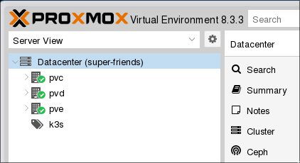

# **Build Your Own Cloud**

Using Proxmox Hypervisor

---
# `$whoami`

**Name**: Alexander Reinthal
**Role**: Data Platform Engineer
**Favorite Soup**: Tomato
**Favorite Animal**: Bird
**Recent Obsessions**: Fast Chess, Counter-Strike 2

---

## What is the Cloud?

"The cloud is someone else's computer"

Star wars meme, normal distribution

---
## Datacenter designs

---

### The SAN era (1990s-2000s)

- SAN: Storage Area Network

Storage <-> network <-> Machines

- Advantage: Backups, Disaster Recovery, Easily swap drives with zero downtime.
- Disadvantage: Very Complex, difficult to scale, significant investment

---
### The Converged Era (2000s-2010s)

- Pre-engineered bundles of compute, networking and storage
- Advantage: Better scalability of the SAN design.

---
### The Hyperconverged Era (2010s-Today)

With the rise of virtualization, data center design became "hyperconverged".

- Software Defined Storage, Network & Compute.
- Lets practitioners focus less on hardware

---
# What Enabled Hyperconvergence?

- Improved virtualization technology, few CPU percent overheard
- Infrastructure as Code technologies, (Ansible, OpenTofu, Terraform, Pulumi)
- Distributed file systems and object storage (Ceph, GlusterFS)

---

## What Computer Resources do we typically need?

- **Execution Environment**: Run the code. VMs, Containers, Lambdas. 
- **Networking**: Computers need to talk to other Computers
- **Storage**: Object Storage, Volumes, Network shares, Sharepoint?

---
## What are other nice-to-haves?

- Backups
- Identities, who is running the code?
- Applications, Databases, Caches. They sit in top of the other primitives seen
  above.

---

---

# What is the Public Cloud?

UI `<->` API `<->` Resource Backend

- Networking
- Compute
- Storage
- Backups, Geo-redundancy, Serverless, etc.

---
# What is Proxmox?

Hyperconverged Infrastructure 
on commodity hardware

- Networking
- Storage
- VMs
- Linux Containers (LXC)

---

---

# Networking

## Routing

**Hardware**: 4x Gigabit LAN, Quad Core CPU
**Operating System**: PfSense

## Switches

**Hardware**: VLAN compatible switches, 
**Price**: Free <3 Invativa

---

# Physical Servers

- Year 2019, `pve`, i3 4-cores 9th gen, 64 gig RAM
- Year 2024, `pvd`, i7 4-cores 7th gen, 32 gig RAM 
- Year 2024, `pvc`, i7 16-cores 14th gen, 96 gig RAM

# Storage

- Mirrored zfs ssd-drives

---
# Demo

Let's test our hyperconverged  "cloud compute" platform!

- Networking ✅
- Storage ✅
- Compute ✅

---
# Demo: All the resources

---
# Demo: Live Migration

--- 
# Demo: Ransomware & Backups

---
# Limitations of DIY-cloud

- Proxmox supports only up to 1000s nodes per cluster.
- Nodes need < 5ms ping time, multi-site failover not easy.
- No official tofu/terraform provider.

---

# Summary