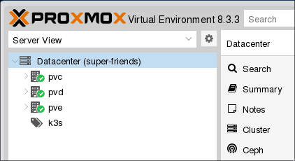

# **Build Your Own Cloud**

Using Proxmox Hypervisor

---

> What you will learn

Fundamentals of building a homelab with enterprise features using Proxmox

---

> Who is this talk for

 Homelabbers, privacy-minded, platform engineers, cloud infra engineers, the curious

---

> What has been excluded

 Security & Monitoring, a lot of other details.

---
#

`$ whoami`

Alexander Reinthal
Data Platform Engineer
**Loves** Tomato Soup
**Loves** Birds

Recently Obsessed with
Fast Chess & Counter-Strike 2

---

## What is the Cloud?

> The cloud is someone else's computer

---

# The goal of cloud technology

- Scale computer infrastructure, and maximize resource utilization
- Enable developers
- Run software

---

# Basic Building Blocks

- **Compute**: VMs, Containers
- **Networking**: NICs, routing, IPs, firewalls etc.
- **Storage**: Object Storage, Volumes, Network Shares
- **Orchestration**: Container Orchestration, High-Availability Failover

---

# Services Provided on Top

- Backups
- Identities
- **Applications**: Databases, Caches, lambdas, pubsub, PaaS etc.

---

# What is Proxmox?

Hyperconverged Infrastructure
on commodity hardware

---

| Feature | Public Cloud (AWS/Azure/GCP) | Proxmox |
|---------|------------------------------|---------|
| **Networking** | ✅ | ✅ |
| **Storage** | ✅ | ✅ |
| **High Availability** | ✅  | ✅  |
| **Applications** | ✅  | ✅  |
| **VMs** | ✅  | ✅ |
| **Containers** | ✅ | ✅   |

---
<!-- _header: '' -->
<!-- _footer: '' -->

---
## Networking

**Router Hardware**: 4x Gigabit LAN, Quad Core CPU
**Router Operating System**: pfSense
**Switches**: VLAN compatible switches

---

# Storage

- Mirrored ZFS SSD-drives

---

# Compute

- `pve`, i3 4-cores 9th gen, 64GB RAM
- `pvd`, i7 4-cores 7th gen, 32GB RAM
- `pvc`, i7 16-cores 14th gen, 96GB RAM

---

---

---
# Demo

Let's test our hyperconverged "cloud compute" platform

- Networking ✅
- Storage ✅
- Compute ✅
- Backups ✅
- High Availability ✅

---

<video src="./video/proxmox-ui.mkv" controls width="100%"></video>

---

<video src="./video/sdn.mkv" controls width="100%"></video>

---

<video src="./video/live-migration.mkv" controls width="100%"></video>

---

<video src="./video/ransomware.mkv" controls width="100%"></video>

---
> Cloud Pricing Comparison

| Provider | Instance Type | CPU | Memory  | Price |
|----------|--------------|-----|--------|-------|
| **Hetzner** | `AX162-R` | 96 threads | 256 GB  | **$221/month** |
| **Azure** | `D4s_v3` | 4 vCPU | 16 GB | **$140/month** |

---

---

---
# Limitations of Proxmox

- Not unlimited scalability
- Multi-site failover not easy
- Hardware/Resource Management
- No OCI-Container management

---

# Discussion

- Time vs cost
- Setup Proxmox on bare-metal in Hetzner a lot cheaper
- Lacks "cloudy" features, some of them not needed?
- Fixed cost
- Self-serve compute and VDI environments for developers

---

# Summary

- Essential Cloud features, networking, storage and compute
- Compared public cloud offerings with Proxmox
- Demo of some Proxmox features
- Bare metal hosts on Hetzner running Proxmox provides one order of magnitude lower prices
- Time vs Cost

---

> The end
